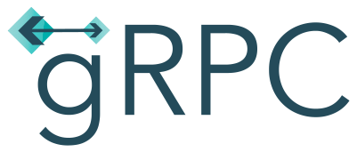

<h1>👋 Olá! Sou Francesco Müller</h1>
<h2>Eu sou um desenvolvedor fullstack focado na stack javascript.</h2>

<ul>
    <li>👨‍💼 Atualmente estou buscando novas oportunidades.</li>
    <li>🖥 Eu estou focado em aprender NextJS.</li>
    <li>🛠 No tempo livre gosto de testar novas tecnologias e projetos pessoais.</li>
</ul>

<h2>Tecnologias Conhecidas</h2>
<table>
    <thead>
        <tr>
            <th>Experiente</th>
            <th>Aprendendo</th>
            <th>Testando e Conhecendo</th>
        </tr>
    </thead>
    <tbody>
        <tr>
            <td>
                
                
                
                
                
                
            </td>
            <td>
                
                
                
                
            </td>
            <td>
                
                
            </td>
        </tr>
    </tbody>
</table>

<h2>Esclarecimentos</h2>

Estou em contante aprendizado, tanto em tecnologias de programação, quanto como experiência pessoal, criando novos projetos para testar e aprender coisas novas.

